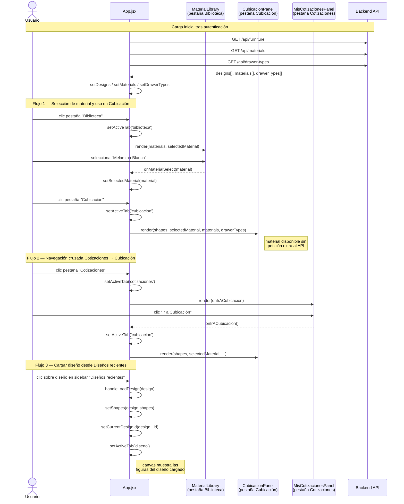

# Pruebas de Caja Negra — Iteración 8: Integración y navegación global

**Historia de usuario:** No aplica (iteración de integración).

**Objetivo:** Verificar que todos los módulos de la aplicación son accesibles a través del sistema de pestañas y que el estado compartido se mantiene correctamente al navegar entre ellos. Incluye comportamiento responsivo en dispositivos móviles.

**Módulo:** `App.jsx` — sistema de navegación por pestañas (Diseño, Cubicación, Biblioteca, Estadísticas, Cotizaciones)

---

## Diagrama de secuencia

---

| ID       | Descripción                                                                            | Entrada                                                                                              | Salida esperada                                                                                      | Resultado |
|----------|----------------------------------------------------------------------------------------|------------------------------------------------------------------------------------------------------|------------------------------------------------------------------------------------------------------|-----------|
| PCN-103  | Todas las pestañas son accesibles desde el dashboard                                   | Usuario autenticado hace clic en cada pestaña: Diseño, Cubicación, Biblioteca, Estadísticas, Cotizaciones | Cada pestaña muestra su panel correspondiente sin errores en consola                                | |
| PCN-104  | Las figuras del canvas persisten al cambiar de pestaña                                 | Agregar 2 módulos en Diseño → cambiar a Cubicación → volver a Diseño                                | El canvas muestra los mismos 2 módulos al regresar; Cubicación los lista correctamente               | |
| PCN-105  | El material seleccionado en Biblioteca está disponible en Cubicación                   | Seleccionar un material en pestaña Biblioteca → cambiar a pestaña Cubicación                         | El material seleccionado aparece activo en el panel de cubicación                                    | |
| PCN-106  | La navegación cruzada Cotizaciones → Cubicación funciona                               | Abrir pestaña Cotizaciones → hacer clic en el botón "Ir a Cubicación"                               | La pestaña activa cambia a Cubicación y se muestra el panel correspondiente                          | |
| PCN-107  | Cargar un diseño desde "Diseños recientes" actualiza el canvas                         | Usuario con diseños guardados → clic sobre un diseño en el panel "Diseños recientes"                 | El canvas carga las figuras del diseño seleccionado y el nombre del diseño aparece en el sidebar     | |
| PCN-108  | El layout responsivo se activa en viewport móvil                                       | Reducir el ancho de la ventana a 400 px (o usar DevTools móvil)                                      | Se muestra el layout móvil: header compacto, tabs con etiquetas cortas (Cubicac., Biblio., etc.)     | |
| PCN-109  | Al iniciar sesión todos los módulos cargan sus datos correctamente                     | Usuario inicia sesión con credenciales válidas                                                        | Materiales, tipos de cajón, diseños y cotizaciones se cargan sin errores; todas las pestañas operativas | |
| PCN-110  | Cerrar sesión limpia el estado y retorna a la pantalla de inicio                       | Usuario autenticado hace clic en "Cerrar sesión"                                                     | Token eliminado, canvas vacío, pantalla de inicio (LandingPage) visible, sin datos residuales         | |
